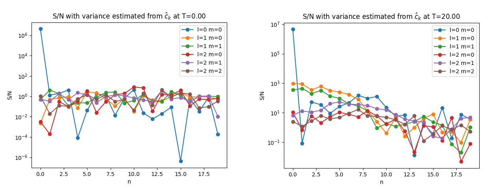
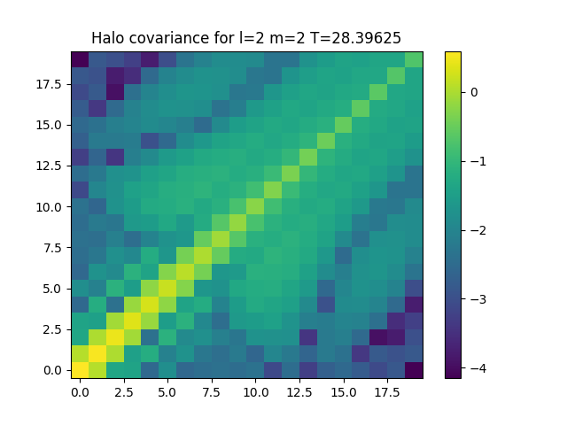

.. role:: python(code)
       :language: python
       :class: highlight

.. _covariance:

Coefficient significance analysis
=================================

.. attention::

   The `exp` interface described below is under development in the
   `OutSample` branch.  You will need to ``git checkout OutSample``
   and recompile to use these features in the `exp` N-body code. The
   `pyEXP` interface is currently available in the `main` branch.
   
.. danger::

   The current `main` branch has an error in the covariance
   computation for the `Cylindrical` force in `pyEXP`.  The fix for
   this is in a recent PR. Users will need to merge that branch
   manually or use the `OutSample` branch for correctness.

Overview
--------

`exp` and `pyEXP` compute both the empirical covariance matrices and
the coefficients in *partitions* or *batches* that may be used to
estimate statistical consistency of coefficients.

Basis function expansions estimate the underlying fields from the
particles that sample their gravitational fields that generate the
particle orbits.  The primary goal of these analyses is the
improvement of field estimates by characterizing their significance.
We do this in two ways:

1. The dynamically induced variation in the gravitational field is
   spread across basis functions.  In other words, the independently
   varying signals are not isolated to specific subset of basis
   functions.  We may use covariance analysis, such as ideas from
   Principal Component Analysis (PCA), to empirically determine a
   basis which separates the initially spatially correlated signals.

2. One may treat the significance of the underlying fields represented
   by the expansion as an estimation problem and attempt to analyze
   the significance of each coefficient using established methods from
   probability and statistics.

The next section introduces the terminology and concepts from sampling
theory necessary to address each of these two goals.  We then move on
to practical applications using `exp`-generated coefficients sets with
`pyEXP`.

.. _covariance_theory:

Theory
------

Notation
^^^^^^^^

Let :math:`\{c_i\}_{i=1}^N\subset\mathbb{R}^d` be the contribution to
the coefficient vector from Particle :math:`i`.  Specifically, if the
potential basis functions are :math:`\Phi_k(\cdot)`, then
:math:`c_i=\{\Phi_1(\mathbf{x}_i), \Phi_1(\mathbf{x}_i), \ldots,
\Phi_d(\mathbf{x}_i)\}` where :math:`\mathbf{x}_i` is the position
vector for Particle :math:`i`.  Denote the empirical mean for the
entire ensemble of :math:`N` particles as

.. math::

   \hat{c} \;=\; \frac{1}{N}\sum_{i=1}^N c_i

and the sample covariance is the :math:`d\times d` matrix

.. math::

   \Sigma \;=\; \frac{1}{N}\sum_{i=1}^N (c_i-\hat{c})(c_i-\hat{c})^{\!\top}.

Partition the particles into :math:`K` disjoint sub samples or
_blocks_ with sizes :math:`n_k` so that :math:`\sum_{k=1}^K n_k =
N`. For each block :math:`k` define

.. math::

   \hat{c}_k \;=\; \frac{1}{n_k}\sum_{i\in\text{block }k} c_i,
   \qquad S_k \;=\; \sum_{i\in\text{block }k}
   (c_i-\hat{c}_k)(c_i-\hat{c}_k)^{\!\top},

where :math:`S_k` is the within‑block scatter.  We may also write the
covariance matrix for each block and relate that to :math:`S_k` as
follows:

.. math::

   \Sigma_k \equiv \frac{1}{n_k}\sum_{i\in\text{block }k}
   (c_i - \hat{c}_k) (c_i - \hat{c}_k)^{\!\top} = \frac{S_k}{n_k}.
   

Overall mean and within and between blocks
^^^^^^^^^^^^^^^^^^^^^^^^^^^^^^^^^^^^^^^^^^

The overall mean, the coefficient vector estimate itself, is the
weighted average of block means:

.. math::

   \hat{c} \;=\; \frac{1}{N}\sum_{k=1}^K n_k \hat{c}_k.

The total scatter, proportional to the covariance matrix, is

.. math::

   S \;=\; \sum_{i=1}^N (c_i-\hat{c})(c_i-\hat{c})^{\!\top},

and the exact decomposition in block quantities is

.. math::

   S \;=\; \underbrace{\sum_{k=1}^K S_k}_{W} \;+\;
   \underbrace{\sum_{k=1}^K
   n_k(\hat{c}_k-\hat{c})(\hat{c}_k-\hat{c})^{\!\top}}_{B}.

The two terms, :math:`W` and :math:`B`, are the *in-block* and
*between-block* scatter, respectively.  Then, the empirical population
covariance is

.. math::

   \Sigma_\textrm{emp} \;=\; \frac{1}{N}S \;=\;
   \frac{1}{N}\sum_{k=1}^K S_k \;+\;
   \sum_{k=1}^K
   \frac{n_k}{N}(\hat{c}_k-\hat{c})(\hat{c}_k-\hat{c})^{\!\top} \;=\;
   \frac{W}{N} + \frac{B}{N}.

The *between block* term :math:`B/N` can be computed from the
:math:`\{\hat{c}_k\}` and :math:`\{n_k\}` alone; the within aggregate
:math:`W` requires the scatter matrices :math:`S_k` or additional
assumptions.

Special case: equal-size blocks
^^^^^^^^^^^^^^^^^^^^^^^^^^^^^^^

`pyEXP` and `exp` partion samples into equal-size blocks by default.
This leads to some additional convenient properties.  Assume each
block has the same size :math:`m`, so :math:`n_k = m` for all
:math:`k`, and :math:`N = Km`.  Define the block mean covariance as

.. math::

   \Sigma_{\hat{c}} \;=\; \frac{1}{K}\sum_{k=1}^K
   (\hat{c}_k-\hat{c})(\hat{c}_k-\hat{c})^{\!\top}.

Then, the *between-block* scatter contribution is

.. math::

   B \;=\; \sum_{k=1}^K m(\hat{c}_k-\hat{c})(\hat{c}_k-\hat{c})^{\!\top}
    \;=\; m \sum_{k=1}^K (\hat{c}_k-\hat{c})(\hat{c}_k-\hat{c})^{\!\top},

and therefore

.. math::

   \frac{B}{N} \;=\; \frac{m}{Km}\sum_{k=1}^K
   (\hat{c}_k-\hat{c})(\hat{c}_k-\hat{c})^{\!\top} \;=\;
   \frac{1}{K}\sum_{k=1}^K
   (\hat{c}_k-\hat{c})(\hat{c}_k-\hat{c})^{\!\top} \;=\;
   \Sigma_{\hat{c}}

Putting all of this together, we have

.. math::

   \Sigma \;=\; \frac{W}{N} + S_{\hat{c}}^{\mathrm{pop}},
   \qquad\text{where } W=\sum_{k=1}^K S_k.

IID block-sampling model
^^^^^^^^^^^^^^^^^^^^^^^^

If additionally each block is formed by :math:`m` independent draws
from the same distribution with mean :math:`\hat{c}` and covariance
:math:`\Sigma` (block independent), then

.. math::

   \mathbb{E}[\hat{c}_k] = \hat{c},\qquad
   \mathbb{E}\!\big[ \Sigma_{\hat{c}} \big] =
   \mathbb{E}\!\big[ \operatorname{Cov}(\hat{c}_k) \big] = \frac{\Sigma}{m}.

This is generally true for `exp` simulations which do not sort
particles within their component and can be made true for any
simulation by selecting particles from the entire particle ensemble
randomly.

.. math::

Therefore, an estimator of :math:`\Sigma` based on the block means is

.. math::

   \widehat{\Sigma} = m\,\Sigma_{\hat{c}},

where :math:`\Sigma_{\hat{c}}` is the empirical covariance of the
block means. One can choose either the natural population-style or
unbiased sample-style form for these estimates:

-   Population-style (divide by :math:`K`):

    .. math::

       \Sigma_{\hat{c}}^{(K)} \;=\; \frac{1}{K}\sum_{k=1}^K
       (\hat{c}_k-\hat{c})(\hat{c}_k-\hat{c})^{\!\top},

    for which :math:`\mathbb{E}[S_{\hat{c}}^{(K)}]=\Sigma/m` when the true
    mean :math:`\hat{c}` is used (i.e., if :math:`\hat{c}` is known). Then
    :math:`\widehat{\Sigma}=m \Sigma_{\hat{c}}^{(K)}` is unbiased (when
    :math:`\hat{c}` is the true mean).

-   Sample-style (divide by :math:`K-1` using the sample mean
    :math:`\hat{c}=(1/K)\sum_k \hat{c}_k`):

    .. math::

       \Sigma_{\hat{c}}^{(K-1)} \;=\; \frac{1}{K-1}\sum_{k=1}^K
       (\hat{c}_k-\hat{\hat{c}})(\hat{c}_k-\hat{\hat{c}})^{\!\top}.
    
    This satisfies

    .. math::

       \mathbb{E}\!\big[\Sigma_{\hat{c}}^{(K-1)}\big] \;=\; \frac{\Sigma}{m},

    so the estimator

    .. math::

       \widehat{\Sigma} \;=\; m\; \Sigma_{\hat{c}}^{(K-1)}

    is unbiased for :math:`\Sigma` under the iid block model.

Relation of the finite-sample to the full covariance
^^^^^^^^^^^^^^^^^^^^^^^^^^^^^^^^^^^^^^^^^^^^^^^^^^^^

Under the iid model, the expected within aggregate satisfies

.. math::

   \mathbb{E}[\Sigma_k] = (m-1)\Sigma, \qquad \mathbb{E}[W] = K(m-1)\Sigma,

hence

.. math::

   \mathbb{E} \left[\frac{W}{N}\right] = \frac{K(m-1)\Sigma}{Km} = \frac{m-1}{m}\Sigma,

and

.. math::

   \mathbb{E} \left[\frac{B}{N}\right] = \frac{\Sigma}{m}.

Adding these gives :math:`\mathbb{E}[\Sigma_{\mathrm{emp}}] = \Sigma`,
verifying unbiasedness of the global empirical covariance.

Summary
^^^^^^^

- If you have only the block means :math:`\{\hat{c}_k\}` and you know that each block is an average of :math:`m` iid draws, then :math:`\widehat{\Sigma}=m\,S_{\hat{c}}^{(K-1)}` is an unbiased estimator of the full covariance :math:`\Sigma`.

- If blocks are not iid samples (e.g. they are clusters with internal
  structure), then multiplying block-mean covariance by :math:`m` is
  not generally valid; additional modeling or within-block information
  is required.

- If you have both the full empirical covariance
  :math:`\Sigma_{\mathrm{emp}}` and the block means, you can compute
  the aggregate within scatter as

  .. math::

      W \;=\; N\Sigma_{\mathrm{emp}} - B,

  and therefore recover the sum of the within-block scatters even
  without individual :math:`S_k`.

- An analysis of the :math:`K` block covariance :math:`\Sigma_k`
  estimates may be used to diagnose the consistency the total
  estimate.  For example, one might use an eigen analysis to determine
  how much of the variance in one block is captured another block,
  such as Krzanowski common subspaces analysis. This is not currently
  offered directly by `pyEXP`.

Practical considerations
^^^^^^^^^^^^^^^^^^^^^^^^

`exp` and `pyEXP` give you the option of computing equal block samples
:math:`\hat{c}_k`, the full empirical covariance
:math:`\Sigma_{\mathrm{emp}}` and the :math:`\Sigma_k=S_k/n_k` for
each block.
  
The main disadvantage to computing all three quantities is disk
space. Let us take a disk basis function expansion with
:math:`M_{max}=4, N_{max}=16` as an example.  The full set of
coefficient vectors for double precision is 2048 bytes.  The
covariance matrix requires 32768 bytes.  If we choose :math:`K=100`
and have 1000 snapshots, our covariance file will be 3.5 GB!  95% of
this is covariance matrices. To save space, a better choice might be
to save the coefficient samples and only the full covariance matrix.
This would reduce our file to 0.2 GB.

Our currently recommended and default strategy saving :math:`K=100`
samples :math:`\hat{c}_k` and the full covariance
:math:`\Sigma_{\mathrm{emp}}` only.  We will described the YAML
configuration for these choices below.

.. _coefficient_SN:

Signal-to-noise estimates
-------------------------

Covariance analysis leads to two alternative strategies that serve
different goals, as follows:

1. The eigenvectors of the covariance matrix :math:`\Sigma` provides a
   new basis that decorrelates the variance. Each eigenvalue
   :math:`\lambda_j` describes the relative contribution of that new
   basis element to the total variance.  Let
   :math:`F(p)\equiv\sum_{j=1}^p\lambda_j` with :math:`p\le d`.  The
   cumulative total may be written as :math:`C(p) = F(p)/F(d)`. The
   denominator :math:`F(d)` simply provides normalization. One may trim
   or truncate on :math:`p` after the cumulative total reaches some
   value.  A typical strategy is to trim at the value of :math:`p`
   that maximizes the curvature of :math:`C(p)`, the so-called *knee*
   method. One may then project the back to the original correlated
   space using only the first :math:`p` vectors.

2. A second strategy is the determination of the squared coefficient
   magnitude to variance ratio, the *signal-to-noise* ratio, using the
   diagonal of the covariance matrix as a proxy of the variance.
   Alternatively, one can characterize the shape of the sub sample
   coefficient distribution and scale the width by :math:`1/\sqrt{K}`,
   following the central limit theorem.  Let the variance of the
   coefficient of order :math:`n` be
   :math:`\mathrm{Var}(\hat{c}_n)`. We may define the signal to noise
   ratio for coefficient :math:`n` as:

   .. math::
      S/N \equiv \frac{|\hat{c}_n|^2}{\mathrm{Var}(\hat{c}_n)}.

   We also know that the expectation for the estimate of the
   coefficient is:

   .. math::
      
      \mathbb{E}[|\hat{c}_n|^2] = |c_n|^2 + \mathrm{Var}(\hat{c}_n).

   This motivates trimming the coefficient series when :math:`S/N\sim
   1`.

   More formally, the functional loss is

   .. math::

      \text{loss}_N = \sum_{n>N} |c_n|^2.

   For smoothing smooth functions, the run of :math:`\text{loss}_N`
   will converge quickly with increasing values of :math:`N`.
   However, if applied directly to :math:`|\hat{c}_n|^2`, this
   estimator will diverge more slowly or may diverge from the exact
   functional loss as :math:`\hat{c}_n` become dominated by noise.
   This motivates the need for smoothing the :math:`\hat{c}_n` to zero
   as :math:`n\rightarrow\infty`.  Applying the trimming argument by
   substituting the expression for :math:`\mathbb{E}[|\hat{c}_n|^2]`
   the definition of :math:`\text{loss}_N`, we find that the estimator
   of the loss from this trimming process is:

   .. math::

      \widehat{\text{loss}}_N = \sum_{n>N}\left[|\hat{c}_n|^2 -
      \mathrm{Var}(\hat{c}_n)\right]_+,
      
   where the notation :math:`[V]_+` indicates that the negative values
   of :math:`V` are truncated to zero.  In other words, choosing the
   truncation value for :math:`N` to be at the point in the series
   where :math:`S/N\sim1` minimizes the functional loss.  This
   suggests that trimming will produce better results, as expected.

   An alternative smoothing procedure follows from the mean-integrated
   square error analysis of the estimator for the series
   :math:`\{\hat{c}_n\}` and this leads to a smoothing weight of the
   form:
	 
   .. math::

      \lambda_n = \frac{|\hat{c}_n|^2}{|\hat{c}_n|^2 +
      \mathrm{Var}(\hat{c}_n)}.

   This bias--variance trade off is described by Silverman in nice
   detail for kernel density estimation.  In practice, this
   prescription seems to perform worse than hard trimming:

   .. math::

      \lambda_n = \begin{cases} 1 & \mathrm{if}\,|\hat{c}_n|^2 >
      \mathrm{Var}(\hat{c}_n) \\ 0 & \mathrm{otherwise}. \end{cases}

   Regardless, some trimming algorithm desirable to prevent noise
   affects from modifying the inferred field estimates.

.. _outsample:

Using `OutSample` with `exp`
----------------------------

Covariance data generation within `exp` is a two step process:

1. The force method computes the sub sample coefficient and covariance
   estimates every `nint` steps.  The configuration parameter `nint`
   is zero by default; no sub samples or sample covariance is computed
   by default.

2. You need to instantiate an `outsamp` output routine in the `Output`
   collection with the `name` parameter to match the name of the
   component whose force has a non-zero `nint` value.

The covariance files are written in HDF5 format and take the form:
`coefcovar.{component name}.{runtag}`.

   
.. _pyEXP_covariance:

Covariance examples in `pyEXP`
------------------------------

The `pyEXP` interface is split between the creation and the reading of
HDF5 covariance files as follows:

1. Similar to the `exp` force methods, the `pyEXP.basis.BiorthBasis`
   classes can be configured to produce sub sample and covariance data
   that get written to an HDF5 file.

2. The utility class `pyEXP.basis.BasisClasses.SubsampleCovariance`
   reads the HDF5 covariance files and returns sample information,
   sub sample coefficients and covariance information in `numpy`
   compatible format.

The controlling configuration YAML keys are:

- `pcavar: true` -- This enables the covariance computation
  
- `samplesz: 100` -- This sets the number of sub samples to `100`.  The
  value `1` is also valid.

- `totalCovar: true` -- Computes a single covariance matrix for the
  entire ensemble.

- `fullCovar: true` -- Computes a covariance matrix for each sub sample

Assume that you have created a basis instance using pyEXP named
`basis`.  After reading and generating coefficients for a particular
snapshot in the usual way, the call

.. code-block:: python

   compname = 'halo'
   runtag   = 'run1'
   time     = 3.14
   basis.writeCoefCovariance(compname, runtag, time)

will write covariance data to file named `coefcovar.halo.run1`,
creating the new file if it does not already exist, and store the
covariance data for time `3.14`.

You can read and HDF5 covariance file with the following code:

.. code-block:: python

   compname = 'halo'
   runtag   = 'run1'
   covar = pyEXP.basis.CovarianceReader('coefcovar.{}.{}'.format(compname, runtag))

A typical use case might be as follows.  We want to estimate the
signal to noise for coefficients in a simulation.  We read in
the HDF5 covariance file and estimate the empirical sample covariance
using the estimator from block means.  Code to do this might look like
the following:

.. code-block:: python

   times  = covar['dark'].Times()
   ntimes = len(times)
   indx   = 0
   time   = times[indx]
   #
   # Get the sample data for this time.  In this example, we use indx=0
   which is T=0.0
   #
   counts, masses, coefs, covrs = covar['dark'].getCoefCovariance(time)
   #
   # The basic info for this block sampled data is:
   #
   numb   = np.sum(masses)
   mass   = np.sum(counts)
   nsamp  = counts.shape[0]
   #
   # We now plot the signal to noise ratios for l=0,1,2
   #
   for l in range(3):
      for m in range(l+1):
      L = basis['dark'].I(l, m)
      #
      sumCof = np.zeros((nmaxh), dtype=np.complex128)
      for T in range(nsamp):
         sumCof += coefs[T, L, :]
      # The sub sample mean
      sumCof /= nsamp
      # Make the covariance matrix using np.cov.  This will automatically normalize
      varmat = np.zeros((nmaxh, nsamp), dtype=np.complex128)
      for T in range(nsamp):
         varmat[:, T] = coefs[T, L, :]
      val = np.cov(varmat)
      sn = np.zeros(val.shape[0])
      for i in range(val.shape[0]):
         sn[i] = np.abs(sumCof[i])**2*nsamp/np.abs(val[i, i])
      plt.semilogy(sn, '-o', label='l={} m={}'.format(l, m))
   plt.legend()
   plt.xlabel('n')
   plt.ylabel('S/N')
   plt.title('S/N with variance estimated from $\hat c_k$ at T={:4.2f}'.format(times[indx]))
   plt.savefig('sn_k.png')

This simulation is an mildly :math:`l=1` unstable truncated NFW-like
DM model.  The plot below shows the S/N ratios for the coefficients
for the initial conditions and later, after the instability has developed.

The result is:

    Signal-to-noise ratios for harmonics :math:`l=0,1,2` for all
    :math:`m` values at the initial time (left) and after the dipole
    instability has developed (:math:`T=20`).  At :math:`T=0`, only
    the first term with :math:`l=m=n=0` has significance.  At later
    time, :math:`T=20`, the :math:`l=1` terms in addition to the
    :math:`l=1` terms are significant.

The following example illustrates the visualization of the full
covariance matrix for the same simulation.

.. code-block:: python

   # This gets the list of available snapshot times
   times  = covar.Times()
   ntimes = len(times)
   #
   # As an example, let's look at the data for the final time
   indx   = -1
   time   = times[indx]
   #
   # Get all the sub sample data for time
   counts, masses, coefs, covrs = covar['dark'].getCoefCovariance(time)
   #
   # The counts array contains the number of particles in each sample
   #
   # The masses array contains the mass of the particles in each sample
   #
   # The coefs is an ndarray of coefficient vectors indexed by sample
   # number and harmonic order
   #
   # The coefs is an ndarray of covariance matrices indexed by sample
   # number and harmonic order
   #
   # Following code shows how to visualize the covariance matrices
   # using pcolormesh
   #
   numb   = np.sum(counts)
   mass   = np.sum(masses)
   nsamp  = counts.shape[0]
   #
   # For pcolormesh below
   x = np.arange(0, nmaxh)
   y = np.arange(0, nmaxh)
   X, Y = np.meshgrid(x, y)
   #
    for l in range(3):
     for m in range(l+1):
        L = basis['dark'].I(l, m)
        sumCof = np.zeros((nmaxh), dtype=np.complex128)
        sumVar = np.zeros((nmaxh, nmaxh), dtype=np.complex128)
        for T in range(nsamp):
            sumCof += coefs[T, L, :]/mass
            sumVar += covrs[T, L, :, :]/mass
        sumVar -= np.outer(sumCof, sumCof)
        # sumVar is not the full normalized covariance
        plt.pcolormesh(X, Y, np.log10(np.abs(sumVar)), cmap='viridis')
        plt.colorbar()
        plt.title('Halo covariance for l={} m={} T={}'.format(l, m, times[-1]))
        plt.show()

    Example output for :math:`l=m=2` for a simulation of a DM halo with
    :math:`N=10^6` particles.  The color scale shows the logarithm
    base 10 of the absolute value of the covariance elements. The
    diagonal dominance is expected.
