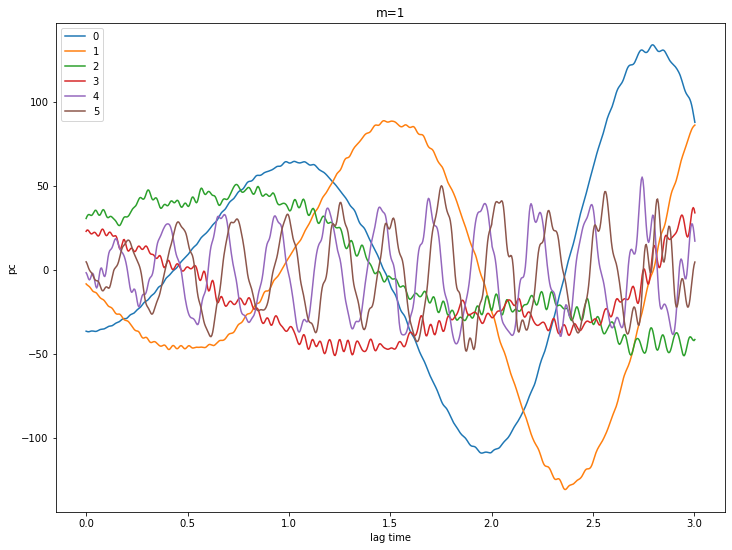
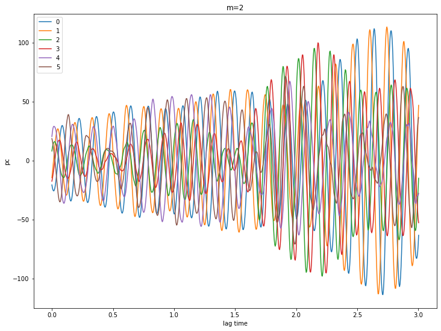

.. _using-mssa:

How to use mSSA with your coefficient series in pyEXP
=====================================================

Begin with the usual imports

.. code:: python

    import os
    import copy
    import yaml
    import time
    import pyEXP
    import numpy as np
    import matplotlib.pyplot as plt
    from matplotlib import ticker
    from os.path import exists
    
    plt.rcParams['figure.figsize'] = [12, 9]

Switch to the working directory
~~~~~~~~~~~~~~~~~~~~~~~~~~~~~~~

I like to be explicit about my working directory but you don’t need to
do this here. It would be sufficient to simply pass the full path to the
coefficient factory below.

.. code:: python

    # os.chdir('/data/Nbody/Run101')

Read the EXP config files and generate the bases
~~~~~~~~~~~~~~~~~~~~~~~~~~~~~~~~~~~~~~~~~~~~~~~~

.. code:: python

    # Read the basis info from the EXP file
    #
    exp_config = 'step3_try25.yml'
    stride     = 2
    npc        = 40
    size       = 0.05
    npix       = 50
    
    # Open and read the EXP yaml file.  Get the runtag. Create the bases
    # and construct coefficient file names
    #
    config = {}
    basis  = {}
    fcoef  = {}
    runtag = ""
    
    with open(exp_config, 'r') as f:
        yaml_db = yaml.load(f, Loader=yaml.FullLoader)
    
        # Get the runtag
        #
        runtag = yaml_db['Global']['runtag']
        print("\nRuntag from {} is: {}".format(exp_config, runtag))
    
    
        # Grab YAML force stanzas for all components
        #
        for v in yaml_db['Components']:
            comp = v['name']
            config[comp] = yaml.dump(v['force'])
                   
            # Construct the basis instance
            #
            basis[comp] = pyEXP.basis.Basis.factory(config[comp])
    
            # Get the coefficient files
            fcoef[comp] = 'outcoef.{}.{}.h5'.format(comp, runtag)
            print("\nCoef file is:", fcoef[comp])

.. parsed-literal::

    
    Runtag from step3_try25.yml is: run45_3
    
    Coef file is: outcoef.dark.run45_3.h5
    ---- SLGridSph::write_cached_table: done!!
    ---- EmpCylSL::cache_grid: file read successfully
    ---- EmpCylSL::read_cache: table forwarded to all processes
    
    Coef file is: outcoef.star.run45_3.h5

.. parsed-literal::

    SLGridSph: opened <.slgrid_sph_cache>
    Slave    0: tables allocated, MMAX=6

Read the coefficients and the MSSA files
----------------------------------------

.. code:: python

    # Just do star component for now
    #
    comp = 'star'
    
    coefs0 = pyEXP.coefs.Coefs.factory(fcoef[comp], stride=stride)
    coefs  = coefs0.deepcopy()
    
    # Make some custom [m, n] pairs
    keylst = {}
    for m in range(7):
        keylst[m] = coefs.makeKeys([m])
    
    
    ssa = {}
    ev  = {}
    cum = {}
    
    totPow = 0.0
    
    for m in range(7):
    
        config = {coefs.getName(): (coefs, keylst[m], [])}
    
        window = int(len(coefs.Times())/2)
    
        flags ="""
    ---
    RedSym : true
    # totPow : true
    # noMean : true
    ...
    """
        print("Window={} PC number={}".format(window, npc))
    
        startTime = time.time()
        ssa[m] = pyEXP.mssa.expMSSA(config, window, npc, flags)
        file = '{}_{}_{}'.format(runtag, comp, m)
        if os.path.exists(file+"_mssa.h5"):
            ssa[m].restoreState(file)
        totPow += ssa[m].getTotPow()
        ev[m] = ssa[m].eigenvalues()
        cum[m] = ssa[m].cumulative()
        if not os.path.exists(file+"_mssa.h5"):
            ssa[m].saveState(file)
            print('Computed eigenvalues in {:6.2f} seconds'.format(time.time() - startTime))

.. parsed-literal::

    Window=750 PC number=40
    Window=750 PC number=40
    Window=750 PC number=40
    Window=750 PC number=40
    Window=750 PC number=40
    Window=750 PC number=40
    Window=750 PC number=40

Plot the eigenvalues
--------------------

.. code:: python

    # Make a plot of the eigenvalues
    #
    for m in range(7):
        plt.semilogy(ev[m], '-o', label=str(m))
    plt.xlabel('Index')
    plt.ylabel('Eigenvalue')
    plt.legend()
    plt.show()

.. image:: disk_mssa_files/disk_mssa_9_0.png

Let’s look at some PCs
----------------------

.. code:: python

    for m in [0,1,2,3,4]:
        pcs = ssa[m].getPC()
        ntim = pcs.shape[0]
        for n in range(6):
            plt.plot(coefs.Times()[0:ntim], pcs[:,n], label=str(n))
        plt.xlabel('lag time')
        plt.ylabel('pc')
        plt.legend()
        plt.title('m={}'.format(m))
        plt.show()

.. image:: disk_mssa_files/disk_mssa_11_0.png

.. image:: disk_mssa_files/disk_mssa_11_3.png

.. image:: disk_mssa_files/disk_mssa_11_4.png

.. code:: python

    ssa[2].reconstruct([0,1,2,3])

.. code:: python

    coefs.zerodata()
    ssa[2].getReconstructed()
    print(len(coefs.Times()))

.. parsed-literal::

    1501

Check by making some surface renderings
~~~~~~~~~~~~~~~~~~~~~~~~~~~~~~~~~~~~~~~

Uses the final time slice but you could easily loop through all of them
to make a movie, etc.

.. code:: python

    # Make the coefficients by the factory method
    #
    
    print('The coefficient time list is {} slices in [{}, {}]', len(coefs.Times()), coefs.Times()[0], coefs.Times()[-1])
    #
    times = coefs.Times()[-2:-1]
    pmin  = [-size, -size, 0.0]
    pmax  = [ size,  size, 0.0]
    grid  = [  npix, npix,   0]
    
    print('Creating surfaces with times:', times)
    
    fields = pyEXP.field.FieldGenerator(times, pmin, pmax, grid)
    
    print('Created fields instance')
    
    surfaces = fields.slices(basis[comp], coefs)
    
    print('Created surfaces')
    
    print("We now have the following [time field] pairs")
    final = 0.0
    for v in surfaces:
        print('-'*40)
        for u in surfaces[v]:
            print("{:8.4f}  {}".format(v, u))
            final = v
    
    # Print the potential image at the final time
    # 
    nx = surfaces[final]['d'].shape[0]
    ny = surfaces[final]['d'].shape[1]
    
    x = np.linspace(pmin[0], pmax[0], nx)
    y = np.linspace(pmin[1], pmax[1], ny)
    xv, yv = np.meshgrid(x, y)
    
    # cont1 = plt.contour(xv, yv, surfaces[final]['d'].transpose(), colors='k', locator=ticker.LogLocator())
    cont1 = plt.contour(xv, yv, surfaces[final]['d'].transpose(), colors='k')
    plt.clabel(cont1, fontsize=9, inline=True)
    # cont2 = plt.contourf(xv, yv, surfaces[final]['d'].transpose(), locator=ticker.LogLocator())
    cont2 = plt.contourf(xv, yv, surfaces[final]['d'].transpose())
    plt.colorbar(cont2)
    plt.xlabel('x')
    plt.ylabel('y')
    plt.title('Density at T={}'.format(final))
    plt.show()
    
    cont1 = plt.contour(xv, yv, surfaces[final]['d1'].transpose(), colors='k')
    plt.clabel(cont1, fontsize=9, inline=True)
    cont2 = plt.contourf(xv, yv, surfaces[final]['d1'].transpose())
    plt.colorbar(cont2)
    plt.xlabel('x')
    plt.ylabel('y')
    plt.title('Nonaxisymmetric density at T={}'.format(final))
    plt.show()
    
    cont1 = plt.contour(xv, yv, surfaces[final]['fr'].transpose(), colors='k')
    plt.clabel(cont1, fontsize=9, inline=True)
    cont2 = plt.contourf(xv, yv, surfaces[final]['fr'].transpose())
    plt.colorbar(cont2)
    plt.xlabel('x')
    plt.ylabel('y')
    plt.title('Radial force at T={}'.format(final))
    plt.show()
    
    cont1 = plt.contour(xv, yv, surfaces[final]['ft'].transpose(), colors='k')
    plt.clabel(cont1, fontsize=9, inline=True)
    cont2 = plt.contourf(xv, yv, surfaces[final]['ft'].transpose())
    plt.colorbar(cont2)
    plt.xlabel('x')
    plt.ylabel('y')
    plt.title('Vertical force at T={}'.format(final))
    plt.show()

.. parsed-literal::

    The coefficient time list is {} slices in [{}, {}] 1501 0.0 5.998
    Creating surfaces with times: [5.994]
    Created fields instance
    Created surfaces
    We now have the following [time field] pairs
    ----------------------------------------
      5.9940  d
      5.9940  d0
      5.9940  d1
      5.9940  dd
      5.9940  fp
      5.9940  fr
      5.9940  ft
      5.9940  p
      5.9940  p0
      5.9940  p1

.. image:: disk_mssa_files/disk_mssa_15_1.png

.. image:: disk_mssa_files/disk_mssa_15_2.png

.. image:: disk_mssa_files/disk_mssa_15_3.png

.. image:: disk_mssa_files/disk_mssa_15_4.png

Okay, now make a movie
----------------------

.. code:: python

    size  = 0.05
    npix  = 50
    times = coefs.Times()
    pmin  = [-size, -size, 0.0]
    pmax  = [ size,  size, 0.0]
    grid  = [ npix,  npix,   0]
    
    fields = pyEXP.field.FieldGenerator(times, pmin, pmax, grid)
    
    print('Created fields instance')
    
    surfaces = fields.slices(basis[comp], coefs)

.. code:: python

    # Get the shape
    keys = list(surfaces.keys())
    nx = surfaces[keys[0]]['d'].shape[0]
    ny = surfaces[keys[0]]['d'].shape[1]
    
    # Make the mesh
    x = np.linspace(pmin[0], pmax[0], nx)
    y = np.linspace(pmin[1], pmax[1], ny)
    xv, yv = np.meshgrid(x, y)
    
    plt.rcParams.update({'font.size': 22})
    
    # Fix the contour levels to prevent jitter in the movie (linear scaling)
    mval = 200.0
    cbar1 = np.arange(-mval, mval, 1.00)
    cbar2 = np.arange(-mval, mval, 20.0)
    
    # Frame counter
    icnt = 0
    cmap = copy.copy(plt.colormaps['viridis'])
    
    N = cmap.N
    cmap.set_under(cmap(1))
    cmap.set_over(cmap(N-1))
    
    # Iterate through the keys
    for v in keys:
        fig, ax = plt.subplots(1, 1, figsize=(24, 20))
        
        mat = surfaces[v]['d']
        #for i in range(mat.shape[0]):
         #   for j in range(mat.shape[1]):
          #      if mat[i, j] < 1.0: mat[i, j] = 1.0
           #     if mat[i, j] > 10000.0: mat[i, j] = 10000.0
                
        cont1 = ax.contour(xv, yv, mat.transpose(), cbar2, colors='k')
        # You can label the contours inline by uncommenting the next two lines...
        # ax[0].clabel(cont1, fontsize=9, inline=True)
        # cont2 = ax.contourf(xv, yv, surfaces[v]['d'].transpose(), cbar2, vmin=cbar2[0], vmax=cbar2[-1])
        cont2 = ax.contourf(xv, yv, mat.transpose(), cbar1) #, locator=ticker.LogLocator())
        plt.colorbar(cont2, ax=ax)
        ax.set_xlabel('x')
        ax.set_ylabel('y')
        ax.set_title('T={:4.3f}'.format(v))
        
        fig.savefig('{}_mssa_{}_{:04d}.png'.format(comp, runtag, icnt), dpi=75)
        plt.close()
    
        icnt += 1

Make a mp4 file from the frames using ffmpeg
--------------------------------------------

This only work if you have ‘ffmpeg’ installed, of course …

.. code:: python

    os.system('ffmpeg -y -i \'{0}_mssa_{1}_%04d.png\' mssa_{0}_{1}.mp4'.format(comp, runtag))
