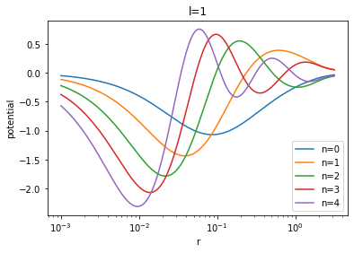
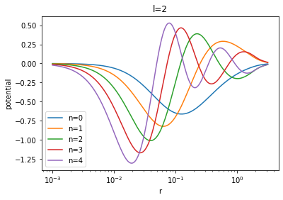

.. _visualizing-bases:

How to visualize the BFE bases used to make your coefficients
=============================================================

This is easy with pyEXP.  Each of the three main basis types supported
by pyEXP, ``SphericalSL``, ``Cylindrical``, and ``FlatDisk`` provides
a ``getBasis`` member function that returns the basis functions in
their native geometry.

Let's work a few simple examples to give you all you need to look at
your bases.  A Jupyter notebook implementing these examples, 
``viewing_a_basis.ipynb``, is available in the `pyEXP examples repository
<https://github.com/EXP-code/pyEXP-examples>`_ in the
`Tutorials/Basis` directory.

A spherical basis
-----------------

.. _visualizing-spherical-basis:

Start with a simple configuration file for spherical basis and
instantiate the basis:

.. code-block:: python

   # Make the halo basis config
   halo_config="""
   ---
   id: sphereSL
   parameters :
     numr:  2000                  # number of radial grid points
     rmin:  0.0001                # smallest radial grid point
     rmax:  1.95                  # largest radial grid point
     Lmax:  4                     # maximum spherical harmonic degree
     nmax:  10                    # maximum radial order
     rmapping: 0.0667             # radius for coordinate mapping
     modelname: SLGridSph.model   # model file name
   ...
   """
   #
   halo_basis = pyEXP.basis.Basis.factory(halo_config)

The ``getBasis`` member for each basis returns a vector of arrays for
the basis functions on the grid you have defined.  For the spherical
or flat disk case, the basis functions are one-dimensional functions.
We provide a beginning and ending radius in logarithmic units along
with a grid size:

.. code-block:: python

   # Get the basis grid
   #
   lrmin = -3.0
   lrmax = 0.5
   rnum  = 200
   halo_grid = halo_basis.getBasis(lrmin, lrmax, rnum)

Now that we have the basis function grids, we can plot them.  For example:

.. code-block:: python

   # Make a logarithmically spaced grid in radius
   #
   r = np.linspace(lrmin, lrmax, rnum)
   r = np.power(10.0, r)

   for l in range(3):
      for n in range(5):
         plt.semilogx(r, halo_grid[l][n], '-', label="n={}".format(n))
      plt.xlabel('r')
      plt.ylabel('potential')
      plt.title('l={}'.format(l))
      plt.legend()
      plt.show()
  
The resulting images are:

.. image:: sph_basis_0.png
   :height: 600 px
   :width: 800 px
   :scale: 50 %
   :alt: figure showing the 1-d halo basis functions for l=0
   :align: center

Cylindrical basis
-----------------

.. _visualizing-cylindrical-basis:

Now let's do the same for a cylindrical basis.  The main difference
here is that the basis functions are two-dimensional meriodinal planes.

As before let's begin by configuring and instantiating our basis:

.. code-block:: python

   # Make the disk basis config
   #
   disk_config = """
   ---
   id: cylinder
   parameters:
     acyl: 0.01                   # exponential disk scale length
     hcyl: 0.001                  # exponential disk scale height
     nmaxfid: 32                  # maximum radial order for spherical basis
     lmaxfid: 32                  # maximum harmonic order for spherical basis
     mmax: 6                      # maximum azimuthal order of cylindrical basis
     nmax: 8                      # maximum radial order of cylindrical basis
     ncylodd: 3                   # vertically anti-symmetric basis functions
     ncylnx: 256                  # grid points in radial direction
     ncylny: 128                  # grid points in vertical direction
     rnum: 200                    # radial quadrature knots for Gram matrix
     pnum: 0                      # azimuthal quadrature knots for Gram matrix
     tnum: 80                     # latitudinal quadrature knots for Gram matrix
     ashift: 0.5 #                # basis shift for variance generation
     vflag: 0                     # verbose output flag
     logr: false #                # logarithmically spaced radial grid
     density: false               # generate density basis functions
     eof_file: .eof.cache.run0    # EOF cache file name
   ...
   """

The `ncylodd` parameters sets the number of vertically anti-symmetric  
basis functions.  The first `nmax-ncylodd` basis functions are symmetric
and the last `ncylodd` are vertically anti-symmetric.  You can adjust
these parameters to provide the desired number of basis functions,
anticipating the degree of vertical symmetry.

We provide a beginning and ending cylindrical radius and a beginning
and ending vertical extent, this time in linear units (matching the *logr*
parameter given in the config):

.. code-block:: python

   # Get the two-dimensional basis grid
   #
   Rmin = 0.0
   Rmax = 0.1
   Rnum = 100
   Zmin = -0.03
   Zmax =  0.03
   Znum = 40

   disk_grid = disk_basis.getBasis(Rmin, Rmax, Rnum, Zmin, Zmax, Znum)

We'll use Pyplot's `contourf` to visualize the meridional-plane basis
functions:

.. code-block:: python

   R = np.linspace(Rmin, Rmax, Rnum)
   Z = np.linspace(Zmin, Zmax, Znum)
   #
   xv, yv = np.meshgrid(R, Z)
   #
   for m in range(3):
      for n in range(5):
         # Tranpose for contourf
         cx = plt.contourf(xv, yv, disk_grid[m][n].transpose())
         plt.xlabel('R')
         plt.ylabel('Z')
         plt.title('m, n={}, {}'.format(m, n))
         plt.colorbar(cx)
         plt.show()
  
      
The first three of the resulting images are:

.. image:: cyl_basis_0_0.png
   :height: 600 px
   :width: 800 px
   :scale: 50 %
   :alt: figure showing the 2-d cylindrical basis functions for m=0, n=0
   :align: center

.. image:: cyl_basis_0_1.png
   :height: 600 px
   :width: 800 px
   :scale: 50 %
   :alt: figure showing the 2-d cylindrical basis functions for m=0, n=1
   :align: center

.. image:: cyl_basis_0_2.png
   :height: 600 px
   :width: 800 px
   :scale: 50 %
   :alt: figure showing the 2-d cylindrical basis functions for m=0, n=2
   :align: center

The code above can be easily tweaked to produce only the vertically
antisymmetric basis functions.  Recall that the first `nmax-ncylodd`
are symmetric and the last `ncylodd` are vertically anti-symmetric.
In this case, `nmax=8` and `ncylodd=3`, so indices 5, 6, and 7 are
the vertically antisymmetric basis functions.

.. code-block:: python

   R = np.linspace(Rmin, Rmax, Rnum)
   Z = np.linspace(Zmin, Zmax, Znum)
   #
   xv, yv = np.meshgrid(R, Z)
   #
   for m in range(3):
      for n in range(5, 8):
         # Tranpose for contourf
         cx = plt.contourf(xv, yv, disk_grid[m][n].transpose())
         plt.xlabel('R')
         plt.ylabel('Z')
         plt.title('m, n={}, {}'.format(m, n))
         plt.colorbar(cx)
         plt.show()
  
The first three anti-symmetric basis functions are:

.. image:: cyl_basis_0_5.png
   :height: 600 px
   :width: 800 px
   :scale: 50 %
   :alt: figure showing the 2-d cylindrical basis functions for m=0, n=5
   :align: center

.. image:: cyl_basis_0_6.png
   :height: 600 px
   :width: 800 px
   :scale: 50 %
   :alt: figure showing the 2-d cylindrical basis functions for m=0, n=6
   :align: center

.. image:: cyl_basis_0_7.png
   :height: 600 px
   :width: 800 px
   :scale: 50 %
   :alt: figure showing the 2-d cylindrical basis functions for m=0, n=7
   :align: center

We can visualize the basis for ``FlatDisk`` using the same steps as
``SphericalSL``.
